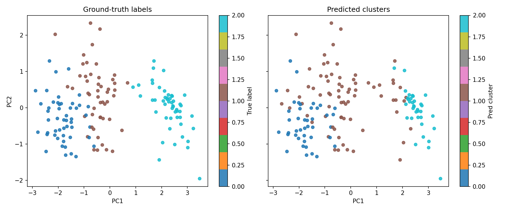
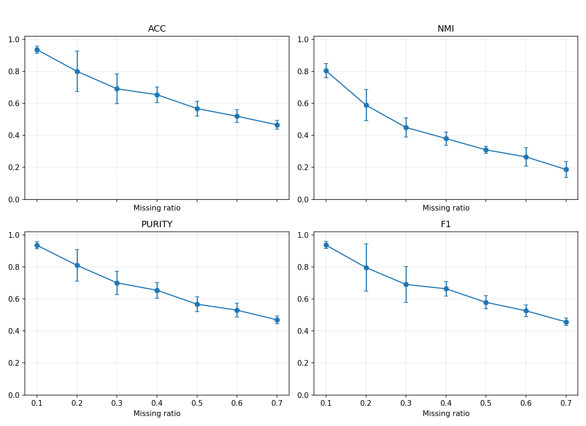

# Python GMM Clustering with Incomplete Data

This is a **from-scratch Python implementation** of the paper:

> *Gaussian Mixture Model Clustering with Incomplete Data* (ACM TOMM 2021)

The implementation follows the paper's alternating optimization:
1. E-step: compute posterior responsibilities.
2. M-step: update mixture weights, means, and covariances.
3. Missing-data update: optimize missing entries while keeping observed entries fixed.

Only `numpy`, `pandas`, and Python standard library are used.

## Project structure

- `pygmm_incomplete/core.py` — main algorithm (`IncompleteGMM`)
- `pygmm_incomplete/kmeans.py` — from-scratch K-Means for initialization
- `pygmm_incomplete/imputers.py` — mean and zero imputation
- `pygmm_incomplete/metrics.py` — ACC, NMI, Purity, F1 (from scratch)
- `pygmm_incomplete/synthetic.py` — synthetic data generation + missingness injection
- `run_demo.py` — runnable CLI demo
- `run_demo_visual.py` — demo with visualizations (missing map, convergence curve, 2D projection)
- `benchmark_missing_ratio.py` — benchmark over multiple missing ratios (paper-style)
- `tests/test_smoke.py` — smoke test
- `data/template_input.csv` — CSV template for your input data format

## Quick start

Install dependencies:

```bash
pip install -r requirements.txt
```

#### 1. Run visual demo (Iris-style Kaggle schema, auto-generate plots):

```bash
python run_demo_visual.py --mode kaggle_iris --clusters 3 --missing-ratio 0.25 --save-generated-csv --write-template
```



- Run visual demo with your CSV:

```bash
python run_demo_visual.py --mode csv --csv-path /path/to/data.csv --label-col label --clusters 4 --output-dir demo_outputs
```

### 2. Run benchmark across missing ratios (Iris-style Kaggle schema):

```bash
python benchmark_missing_ratio.py --mode kaggle_iris --clusters 3 --ratios 0.1,0.2,0.3,0.4,0.5,0.6,0.7 --runs-per-ratio 10 --save-plot --output-dir benchmark_outputs
```




Run benchmark with your CSV:

```bash
python benchmark_missing_ratio.py --mode csv --csv-path /path/to/data.csv --label-col label --clusters 4 --ratios 0.1,0.3,0.5 --runs-per-ratio 5 --save-plot
```

## Notes

- Missing values in input must be `NaN`.
- Observed values remain unchanged during missing-value updates.
- Covariance matrices are regularized with `reg_covar` for numerical stability.
- The algorithm converges to a local optimum and is sensitive to initialization (same as paper/EM behavior).
- Visual artifacts are saved in `demo_outputs/` by default.
- Input CSV should be numeric features; label column is optional but recommended for evaluation metrics.
